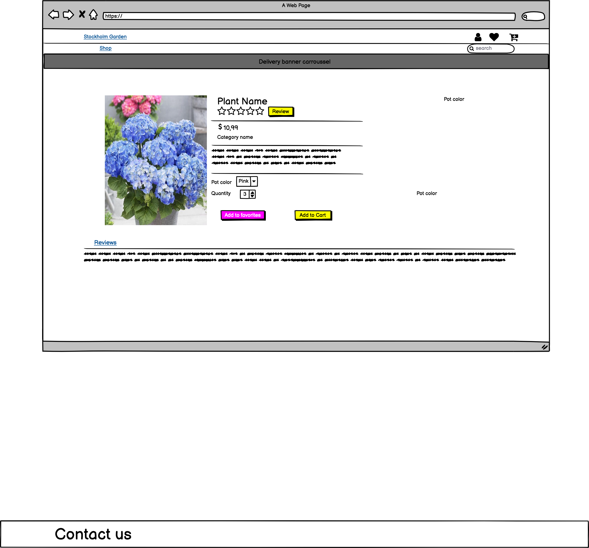

# Full Stack Development, 4th Milestone Code Institute.

## Online Plants E-commerce Store. Stockholm Gaden.
___

[View live project here](https://gardenstockholm.herokuapp.com/)

A fictitious online store setup for study porposes. The company wants to reach as many market possible by selling their products online.

 

## User Experience (UX)

---

### As a user I would like to:

- I want an easy navigation website.
- I want a easy way to acess to all products.
- I want a variety of products to browse.
- I want to have the option of browsing in categories.
- I want to search for something specific with a keyword. 
- I want to have my own account create it easily.
- I want to be able to have a favorites list in my account.
- I want to be able to checkout the products easily.
- I want to see my order history.
- I want feel safe when I purchase with credit card.
- I want to be able to leave a review of the product.
- I want to see contact informations in case I need support from the store.
- I want to be able to access the site from any kind of device.

### Website goals:

- Provide clarity with a layout that satisfy the user needs.
- provide the possibility of anyone  browse recipes without register.
- provide the possibility to the costumer save his favorite items for future shopping. 
- provide easy access to cart and check out.

### Design

- Typography
    - The main fonts chosed for this project were "  EB+Garamond"and "Yeseva+One"

## Wireframes

----

 

## Features

----

### Existing Features

- Navigation Bar
    - Fixed nav bar containing,
        - Logo.
        - My account with acess to register and login, or acess to My account and log out if I am logged in.
        - Favorites.
        - Shopping cart.
        - Shop and categories of products.
        - Search functionallity
- Homepage page with hero image and links to shop. Also a section showing the best sellers in a scrollbar, in construction still.  

- Products.
    - Page showing all the products.
    
- Product category.
    - A page to each category that show only the respectives products.
- Product page.
    - The specific product containing information, add review button, add to favorites button and to cart buttons. Also a section under the product showing the reviews. Also options to choose color to some products and add quantity.    
- Register and login page forms.
- Profile page.
    Showing the user delivery information and order history.
- Shopping cart page with all the products to be purchased. 
- Checkout page where the payment and finalized shopping will happen.
- Favorites page with a button to delete the product.
- Add reviews page.

### Features Left to Implement

- The best selling section will contain infos of the product like in the products page and by click the user will be redirect to the specific product page.
-  Add a subscribe now section and inplementation with strip. 
- Add a footer.
- Add a contact form. 
- Create a new type login and registration forms.
- implement registration and log in with social accounts.
- Have my favorites linked to the user account.
- Allow user to choose color when sending to the favorites page.
- Allow user to send from the favorite directly to the shopping cart.
- Have a number of the products added to favorites showing in the favorite icon on the navbar.
- Have a modal for leaving review instead of a in another page.
- Implement a star rating review system.
- Have a filter products by price and type of plant.
- Fix the bugs found.

## Technologies Used

___

- [HTML](https://en.wikipedia.org/wiki/HTML5)
- [CSS](https://en.wikipedia.org/wiki/CSS)
- [JAVASCRIPT](https://pt.wikipedia.org/wiki/JavaScript)
- [PYTHON](https://www.python.org/)

### Frameworks, Libraries & Programs Used

- [Bootstrap 4](https://getbootstrap.com/)
   - Grid system and pre made classes to allow formatation and responsiveness.
- [Django](https://www.djangoproject.com/)
  -  framework for rapid development, database and management.
- [JQuery](https://jquery.com/)
  - used along with bootstrap.
- [GIT](https://git-scm.com/)
    - Git was used for version control by commiting to and Pushing to GitHub.
- [Github](https://github.com/)
    - GitHub is being used to store the project.

- [Stripe](https://stripe.com/se)
     - payment platform to validate and accept credit card payments securely.

- [AWS S3](https://aws.amazon.com/s3/)

    -  Used to store static files in the cloud.
- [Heroku](https://dashboard.heroku.com/apps)

## Testing

Manual tests were performed.

- Nav bar items on click redirect to the desired page. 
- Button shop in the home page redirect correctly to the products page.

- Products
    - when clicking in all plants in the navbar it correctly load all the products to the page with the name, price and icon to send the product to the favorites page.
    - The heart icon on click is correctly sending the product to the favorites page.
    - when choosing a specific category in the shop link on the bar, the specific products are displayed.
    - When clicking on a product, the product detail page is displayed with the product information, and add review, add to cart and add to favorites buttons. The reviews sections is shown undert the product. The product category name is also displayed in this page.
    The product gives the option of choosing the color and the amount correctly.
    - Add to cart button works correctly.
    - Add to favorites button working correctly.
    - Add review button working correctly.

- Search input is correctly returning the product with the specific input.

- Favorites.
    - selected producted is rendering correclty and by clicking on icon trash can the product is removed from the list.

- Shopping cart
    - Updated and remove buttons working properly.
    - Price and delivery costs calculated correctly. 
    - Buttons to continue shopping or checkout working properly.

- Check out.
    - Delivery information is being saved from the check out.
    - The shopping with credit card is sucessfully.

- My profile.
    - Save correctly the delivery infomation.
    - It is showing the order purchase history.

- Reviews
    - The product to be reviewd is already seleted on the form without user needs to look for it.
    - Once review is submitted, the same shows under the specific product page detail image.
    - The review shows the username.

### Validator Testing

HTML and CSS tested with W3C Markup Validator and W3C CSS Validator.

### User stories testings.

- I want an easy navigation website.
    - Easy acces to every information needed in the nav bar and buttons around the page.
- I want a easy way to acess to all products and a variety of products to browse.
    - The nav bar has a clear link to shop all the product plus other buttons around the page. There is a good number of different products on the webpage.

- I want to have the option of browsing in categories.
    - Under the link shop, you have a list of categories available on click.
- I want to search for something specific with a keyword. 
    - By typing anything on the search input, it returns a product that contain that keyword , if there is one.
- I want to have my own account.
    - Registration form is provided.
- I want to be able to have a favorites list in my account.
    - To be implemented.
- I want to be able to checkout the products easily.
    - The check out process is very straighfoward, requiring only the dlivery information and credit card details. The user can also save the delivery information in the profile so it will be automatcly filled when checking out the product.
- I want to see my order history.
    - The ordeer history is shown in the profile.
- I want feel safe when I purchase with credit card.
    - Safe payment provided by stripe.
- I want to be able to leave a review of the product.
    - By clicking on the product detail, a button leave review is available and the user review will be displayed in the specific product page.
- I want to see contact informations in case I need support from the store.
    - To be implemented.
- I want to be able to access the site from any kind of device.
    - Stockholm Garden is responsive.

    

### Unfixed Bugs

- At the moment, the user doesnt need to be logged in to save products to the favorites. Not fixed for being short on time.

- I was not able to change the color of heart icon on click to show wich products are favorites.
- the product page detail needs a new UX layout.   Not fixed for being short on time.
- The buttons on the product detail page doesnt follow a nice UX. The changes I applied were not working . Not fixed for being short on time.
- Some sucess messages are missing for the add review and favorites page.
- Two svg images were not able to be pushed from aws. Will be fixing that soon.
- When fixing the -/+ in the cart page, another bug was created, which is all products have now the options of color, and before the flowers category didnt have this option. It is not fixed for being short on time.

    

## Deployment

----

The project was deployed to Heroku using the following steps...

1 -Tell Heroku which applications are required to run by adding pip3 freeze --local > requirements.txt to CLI

2 -Create Procfile - echo web:python app.py>Procfile

3 -Login to Heroku.

4 - Once logged in on your dashboard, we can click to Create a New App

5 -Connect GitHub repository to Heroku.

6 - Click on 'Reveal Config Vars', and tell Heroku which variables are required.

7 - From the deploy section click Deploy Branch Click View

### Making a Local Clone

1 - Log in to GitHub and locate the [GitHub Repository](https://github.com/AdrianaSchmit/Stockholm_garden)

2 - Under the repository name, by the left side of the green Gitpod button click in Code.

3 - To clone the repository using HTTPS, under "Clone with HTTPS", copy the link.

4 - Open Git Bash

5 -Change the current working directory to the location where you want the cloned directory to be made.

6 - Type git clone, and then paste the URL you copied in Step 3.

7 - Press Enter. Your local clone will be created.

8 - Click Deploy Branch

9 - Click View to launch your new app.

## Credits
___

### Content

- content was written by the developer
- Boutique Ado, Code institute - Shopping cart
- Crispy forms - register, login, account and checkout 
- Bootstrap throughout the project.
- [ CodeInstituteSampleRead.me](https://github.com/Code-Institute-Solutions/SampleREADME) for the Deployment section

### Acknowledgements

Thanks to all the tutors  and to the Student Care. Thanks to Martin Lipinski for the support.

